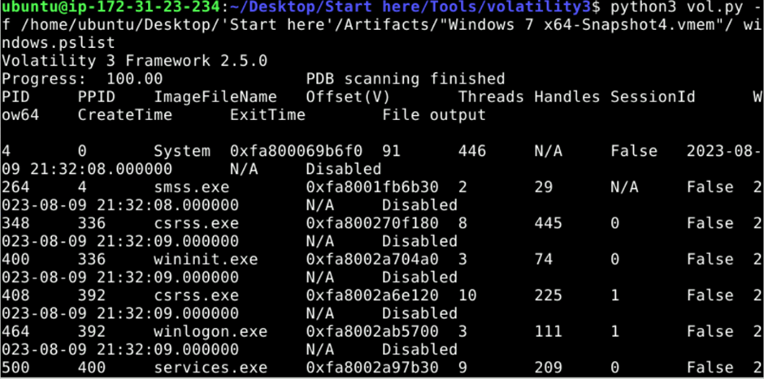
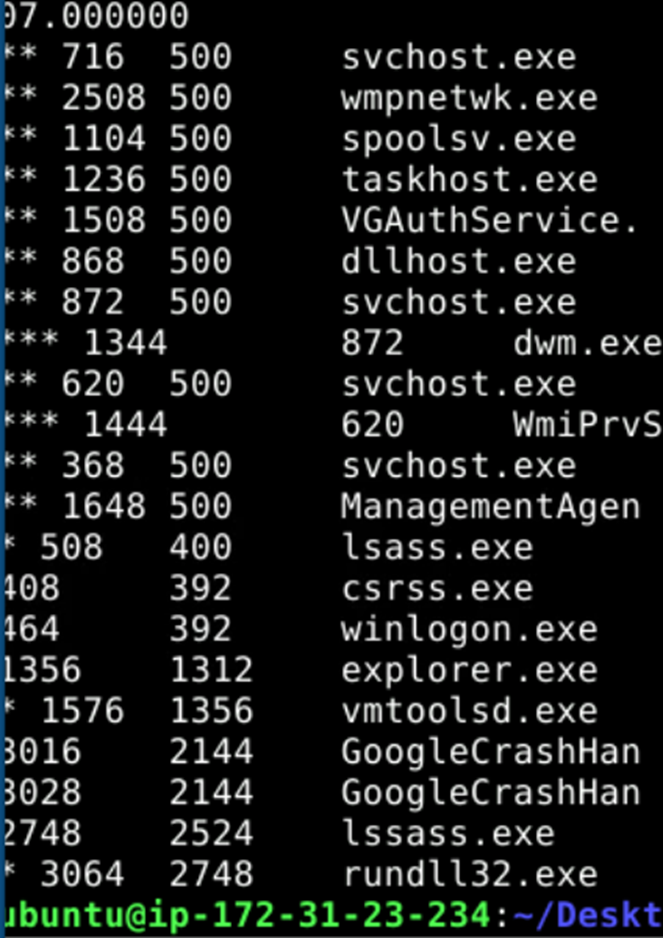
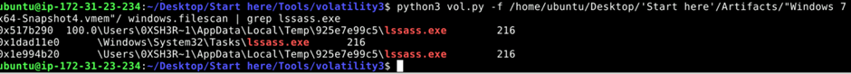
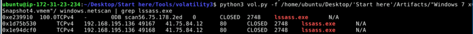
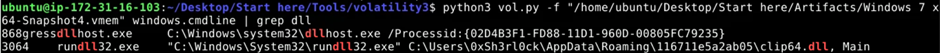
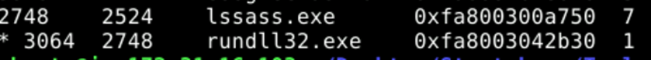
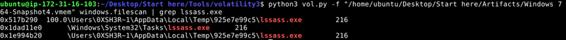

# Amadey - APT-C-36 Lab

Reconstruct Amadey Trojan behavior by analyzing memory dumps with Volatility3 to identify malicious processes, C2 communications, payload delivery, and persistence mechanisms.

**Scenario**

An after-hours alert from the Endpoint Detection and Response (EDR) system flags suspicious activity on a Windows workstation. The flagged malware aligns with the Amadey Trojan Stealer. Your job is to analyze the presented memory dump and create a detailed report for actions taken by the malware.

**Q1**

In the memory dump analysis, determining the root of the malicious activity is essential for comprehending the extent of the intrusion. What is the name of the parent process that triggered this malicious behavior?

The malware try to hide as a legitimate process lsass.exe, which handles authentication and user logins (PID: 508)

**Answers: lssass.exe**

**Q2**

Once the rogue process is identified, its exact location on the device can reveal more about its nature and source. Where is this process housed on the workstation?

We can use windows.filescan to find the location of file then use “grep” command to filter out the process that is suspicious

**Answers: C:\\Users\\0XSH3R~1\\AppData\\Local\\Temp\\925e7e99c5\\lssass.e**

**Q3**

Persistent external communications suggest the malware's attempts to reach out C2C server. Can you identify the Command and Control (C2C) server IP that the process interacts with?

Use the windows.netscan to scan our network and filter with suspicious process, we can easily see that it is making external communication to 41.75.84.12

**Answers: 41.75.84.12**

**Q4**

Following the malware link with the C2C, the malware is likely fetching additional tools or modules. How many distinct files is it trying to bring onto the compromised workstation?

The previous question’s picture also indicates that the malware have two external connections using port 80 (likely that it tried to download something)

**Answers: 2**

**Q5**

Identifying the storage points of these additional components is critical for containment and cleanup. What is the full path of the file downloaded and used by the malware in its malicious activity?

We investigate the child process of lssass.exe which is rundll32.exe and below it shows that child process is used to run the downloaded file

**Answers: C:\\Users\\0xSh3rl0ck\\AppData\\Roaming\\116711e5a2ab05\\clip64.dll**

**Q6**

Once retrieved, the malware aims to activate its additional components. Which child process is initiated by the malware to execute these files?

In the picture below, lssass.exe create a child process to execute downloaded file

**Answers: rundll32.exe**

**Q7**

Understanding the full range of Amadey's persistence mechanisms can help in an effective mitigation. Apart from the locations already spotlighted, where else might the malware be ensuring its consistent presence?

The malware create schedule task that execute them periodically

**Answers: C:\\Windows\\System32\\Tasks\\lssass.exe**
